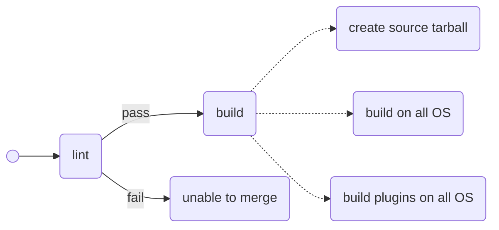
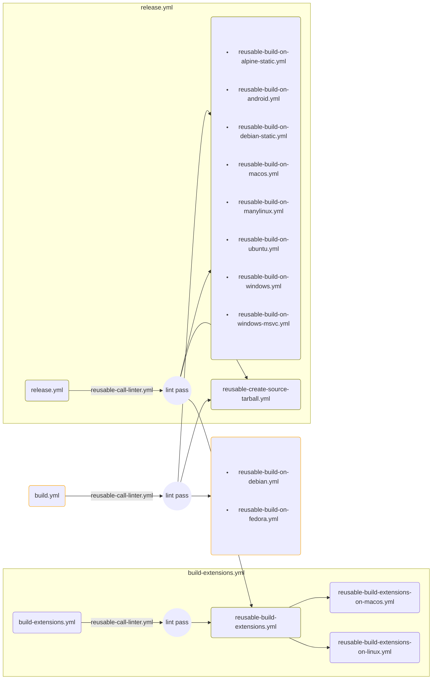

# CI Workflows

This document has not yet covered all workflows.

## Build and Release

### WasmEdge (core)

| OS | Arch | toolchain | `docker_tag` | test | release |
| -- | ---- | --------- | ------------ | ---- | ------- |
| MacOS 13 (darwin 22) | x86_64 | clang || o | o |
| MacOS 14 (darwin 23) | arm64 | clang || o | o |
| manylinux_2_28 | x86_64 | gcc | `manylinux_2_28_x86_64` | o | o |
| manylinux_2_28 | aarch64 | gcc | `manylinux_2_28_aarch64` | o | o |
| Ubuntu 24.04 | x86_64 | clang | `ubuntu-24.04-build-clang` | o ||
| Ubuntu 24.04 | x86_64 | gcc | `ubuntu-24.04-build-gcc` | o ||
| Ubuntu 22.04 | x86_64 | gcc | `ubuntu-22.04-build-gcc` | coverage ||
| Ubuntu 20.04 | x86_64 | clang | `ubuntu-20.04-build-clang` | o | o |
| Ubuntu 20.04 | aarch64 | clang | `ubuntu-20.04-build-clang-aarch64` | o | o |

### WasmEdge plugins

| OS | Arch | toolchain | `docker_tag` | test | release |
| -- | ---- | --------- | ------------ | ---- | ------- |
| MacOS 13 (darwin 22) | x86_64 | clang || o | o |
| MacOS 14 (darwin 23) | arm64 | clang || o | o |
| manylinux_2_28 | x86_64 | gcc | `manylinux_2_28_x86_64-plugins-deps` | o | o |
| manylinux_2_28 | aarch64 | gcc | `manylinux_2_28_aarch64-plugins-deps` | o | o |
| Ubuntu 24.04 | x86_64 | clang | `ubuntu-24.04-build-clang-plugins-deps` | o ||
| Ubuntu 24.04 | x86_64 | gcc | `ubuntu-24.04-build-gcc-plugins-deps` | o ||
| Ubuntu 20.04 | x86_64 | clang | `ubuntu-20.04-build-clang-plugins-deps` | o | o |
| Ubuntu 20.04 | x86_64 | gcc | `ubuntu-20.04-build-gcc-cuda11` | - | - |
| Ubuntu 20.04 | x86_64 | gcc | `ubuntu-20.04-build-gcc-cuda12` | - | - |

Plugins that is built with CUDA enabled:
- `wasmedge_stablediffusion`

## Workflow for `build.yml`

## Calling Structure for Reusable Workflows

