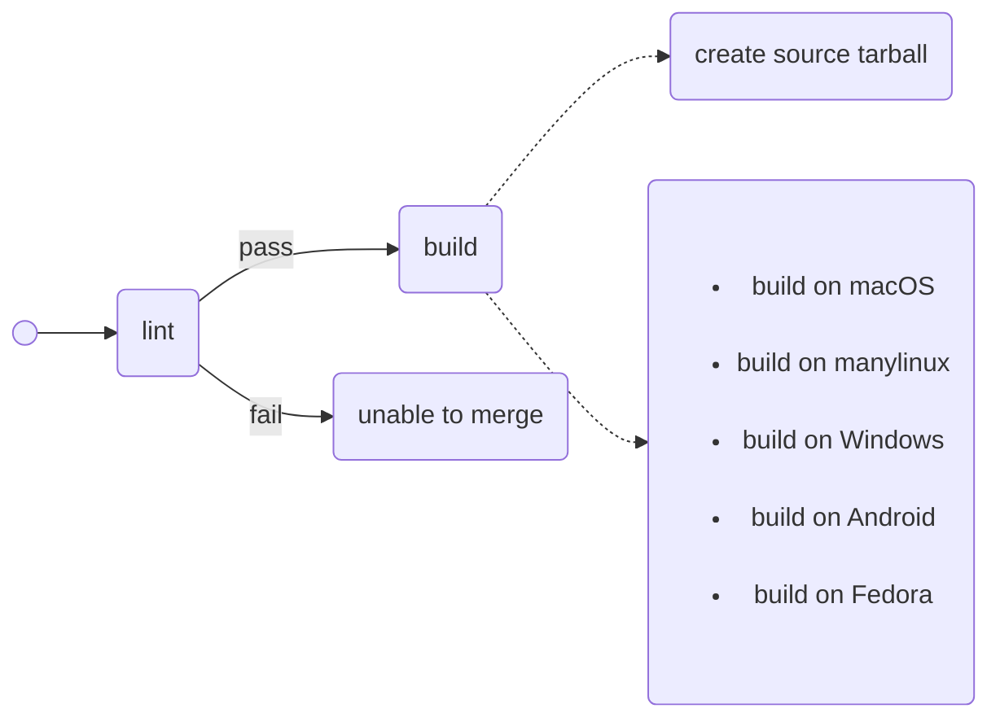

# CI Workflows

This document has not yet covered all workflows.

## build.yml


### macOS
```json
[
  {
    "name": "MacOS 11 (x86_64)",
    "runner": "macos-11",
    "darwin_version": 20
  },
  {
    "name": "MacOS 12 (x86_64)",
    "runner": "macos-12",
    "darwin_version": 21
  }
]
```

### manylinux
```json
[
  {
    "runner": "ubuntu-latest",
    "docker_tag": "manylinux2014_x86_64"
  },
  {
    "runner": "linux-arm64",
    "docker_tag": "manylinux2014_aarch64"
  }
]
```
