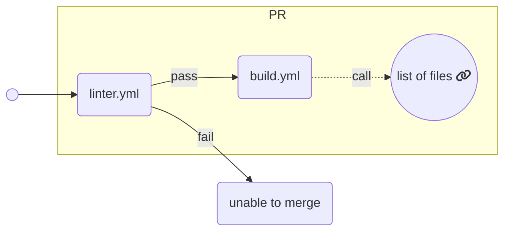

# CI Workflows

This document has not yet covered all workflows.

## Reusable YMLs
- [reusable-create-source-tarball.yml](reusable-create-source-tarball.yml)
- [reusable-build-on-macos.yml](reusable-build-on-macos.yml)
