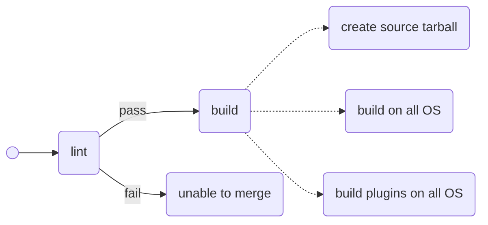
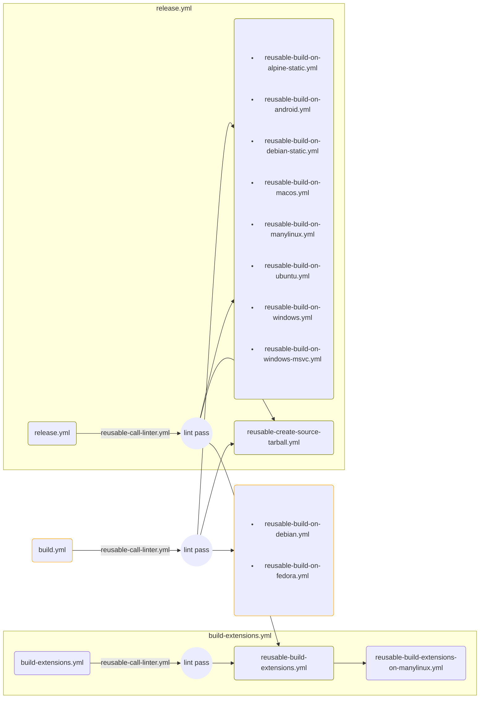

# CI Workflows

This document has not yet covered all workflows.

## Workflow for `build.yml`



### macOS

```json
[
  {
    "name": "MacOS 12 (x86_64)",
    "runner": "macos-12",
    "darwin_version": 21
  },
  {
    "name": "MacOS 14 (arm64)",
    "runner": "macos-14",
    "darwin_version": 23
  }
]
```

### manylinux

```json
[
  {
    "runner": "ubuntu-latest",
    "docker_tag": "manylinux2014_x86_64"
  },
  {
    "runner": "linux-arm64-v2",
    "docker_tag": "manylinux2014_aarch64"
  },
  {
    "runner": "ubuntu-latest",
    "docker_tag": "manylinux_2_28_x86_64"
  },
  {
    "runner": "linux-arm64-v2",
    "docker_tag": "manylinux_2_28_aarch64"
  }
]
```

## Calling Structure for Reusable Workflows


