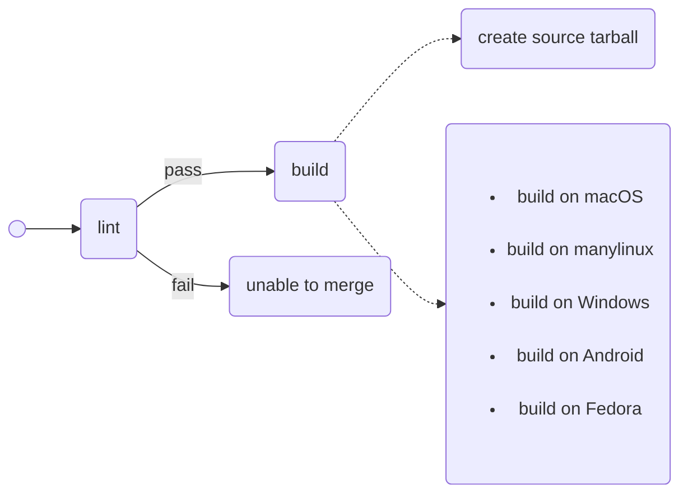

# CI Workflows

This document has not yet covered all workflows.

## build.yml

```mermaid
flowchart LR
    %% _ is the starting point of everything
    _(( ))-->lint(lint)
    lint-->|pass|build(build)
    lint-->|fail|reject(unable to merge)
    build-.->source(create source tarball)
    build-.->oss("<ul>
      <li>build on macOS</li>
      <li>build on manylinux</li>
      <li>build on Windows</li>
      <li>build on Android</li>
      <li>build on Fedora</li>
    </ul>")
```
