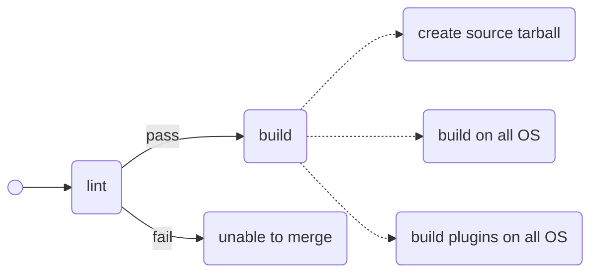
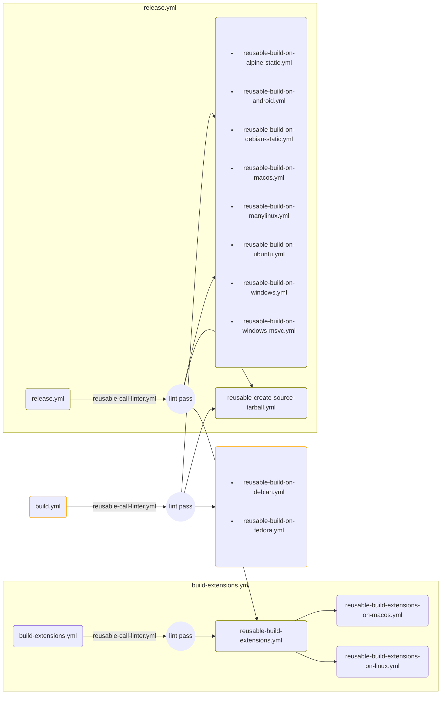

# CI Workflows

This document details the Continuous Integration (CI) workflows for WasmEdge.

## Table of Contents

- [Workflow Classification](#workflow-classification)
  - [Core and Extensions Workflows](#core-and-extensions-workflows)
  - [Linting and Compliance](#linting-and-compliance)
  - [Security and Analysis](#security-and-analysis)
  - [Installers and Specialized](#installers-and-specialized)
  - [Release and Maintenance](#release-and-maintenance)
- [External Checks](#external-checks)
- [Contributor Guidance](#contributor-guidance)
- [Build and Release](#build-and-release)
- [Workflow for build.yml](#workflow-for-buildyml)
- [Calling Structure for Reusable Workflows](#calling-structure-for-reusable-workflows)

## Workflow Classification

The WasmEdge CI is composed of various workflows designed to build, test, and analyze the repository. The following tables detail their triggers, the specific areas of the repository they affect, and the actions expected from contributors if a failure occurs.

*(Note: The `reusable-*.yml` files in this directory are internal workflow components called by the main pipelines and are excluded from these tables. Non-workflow files like `ignore_words` and `matrix-extensions.json` are also excluded.)*

### Core and Extensions Workflows

| Workflow | Triggers | Purpose & Affected Areas | Contributor Expectations |
|----------|----------|--------------------------|--------------------------|
| **Core** (`build.yml`) | PRs, Push | Tests core build and unit tests across major OS. Affects the entire core engine. | Fix all compilation and unit test failures. **Note:** Fedora Rawhide failures may occasionally be caused by upstream OS breakage and are evaluated case-by-case. |
| **Extensions** (`build-extensions.yml`) | PRs, Push | Builds and tests WasmEdge plugins (`plugins/` directory). | Plugin-specific workflow failures generally only matter when the related plugins are modified in your PR. |

### Linting and Compliance

| Workflow | Triggers | Purpose & Affected Areas | Contributor Expectations |
|----------|----------|--------------------------|--------------------------|
| **Commit Lint** (`commitlint.yml`) | PR Target | Enforces Conventional Commits standard on PR titles/commits. | Commits must be amended to match standard prefixes (`feat:`, `fix:`, etc.) before merging. |
| **Misc linters** (`misc-linters.yml`) | PRs, Push | Checks C++ formatting (`clang-format`) and markdown styles. | Format your code using the provided `clang-format` script before pushing. |
| **IWYU checker** (`IWYU_scan.yml`) | PRs, Push | Include-What-You-Use scan to optimize C++ headers. | Review warnings and clean up headers where applicable to keep includes minimal. |

### Security and Analysis

| Workflow | Triggers | Purpose & Affected Areas | Contributor Expectations |
|----------|----------|--------------------------|--------------------------|
| **CodeQL** (`codeql-analysis.yml`) | PRs, Push, Schedule | Security vulnerability analysis via GitHub Advanced Security. | Resolve flagged memory leaks or unsafe patterns. |
| **Static Code Analysis** (`static-code-analysis.yml`) | PRs, Push, Dispatch | Meta's Infer static analyzer for deep code inspection. | Review and address flagged null pointer dereferences or uninitialized variables. |

### Installers and Specialized

| Workflow | Triggers | Purpose & Affected Areas | Contributor Expectations |
|----------|----------|--------------------------|--------------------------|
| **Installers** (`test-installers.yml`) | PRs, Push | Tests `utils/install.py` and `utils/install_v2.sh`. | Ensure installer scripts execute cleanly across environments when modified. |
| **Test Wasi Testsuite** (`wasi-testsuite.yml`) | PRs, Push | Validates `lib/host/wasi` against the official WASI testsuite. | Fix WASI host function implementations if regressions occur. |
| **Arch-specific Builds** (`build_for_riscv.yml`, `build_for_s390x.yml`, `build_for_openwrt.yml`, `build_for_nix.yml`) | PRs, Push | Builds for niche alternative architectures (RISC-V, s390x, OpenWRT, Nix). | Evaluated case-by-case. May occasionally fail due to upstream dependencies rather than your PR. |
| **Docker Build** (`docker.yml`) | PRs, Push, Schedule | Builds container images from `utils/docker/`. | Fix Dockerfile paths and syntax when modifying Docker assets. |

### Release and Maintenance

| Workflow | Triggers | Purpose & Affected Areas | Contributor Expectations |
|----------|----------|--------------------------|--------------------------|
| **Labeler** (`labeler.yml`) | PR Target | Utility to auto-label PRs based on modified paths. | No contributor action needed. |
| **Release** (`release.yml`) | Tag push, Dispatch | Automation to create GitHub releases and tarballs. | No contributor action needed during standard PRs. |
| **Winget Submit** (`winget-submit.yml`) | Release, Dispatch | Automation to submit MSI to Windows Package Manager. | No contributor action needed during standard PRs. |

## External Checks

Some checks are not local `.yml` workflows, but are enforced via GitHub Apps or internal workflow steps:

| Check | Purpose & Affected Areas | Contributor Expectations |
|-------|--------------------------|--------------------------|
| **DCO (Developer Certificate of Origin)** | Enforced by the DCO GitHub App to ensure provenance. | All commits must contain a valid `Signed-off-by` line. |
| **CodeCov** | Uploaded via steps in `build.yml` to track code coverage. | Contributors are expected to maintain or improve code coverage. Significant drops will block merging. |

## Contributor Guidance

When a CI workflow fails on your Pull Request, follow these steps:

1. **Identify the Failing Workflow**: Review the PR checks section at the bottom of your PR.
2. **Review the Logs**: Click "Details", expand the failing step, and look for compiler errors or test failures.
3. **Reproduce Locally**: 
   - **Build/Test Failures**: Attempt to build WasmEdge locally with the same compiler.
   - **Formatting Issues**: Run `clang-format` on your changed files.
   - **Commit Lint**: Use `git commit --amend` to update your message to [Conventional Commits](https://www.conventionalcommits.org/en/v1.0.0/), then `git push --force`.
4. **Ask for Help**: If you cannot determine the cause or suspect a flaky test, comment on your PR asking maintainers for guidance.
## Build and Release

### WasmEdge (core)

| OS | Arch | toolchain | `docker_tag` | test | release |
| -- | ---- | --------- | ------------ | ---- | ------- |
| MacOS 13 (darwin 22) | x86_64 | clang || o | o |
| MacOS 14 (darwin 23) | arm64 | clang || o | o |
| manylinux_2_28 | x86_64 | gcc | `manylinux_2_28_x86_64` | o | o |
| manylinux_2_28 | aarch64 | gcc | `manylinux_2_28_aarch64` | o | o |
| Ubuntu 24.04 | x86_64 | clang | `ubuntu-24.04-build-clang` | o ||
| Ubuntu 24.04 | x86_64 | gcc | `ubuntu-24.04-build-gcc` | o ||
| Ubuntu 22.04 | x86_64 | gcc | `ubuntu-22.04-build-gcc` | coverage ||
| Ubuntu 20.04 | x86_64 | clang | `ubuntu-20.04-build-clang` | o | o |
| Ubuntu 20.04 | aarch64 | clang | `ubuntu-20.04-build-clang-aarch64` | o | o |

### WasmEdge plugins

| OS | Arch | toolchain | `docker_tag` | test | release |
| -- | ---- | --------- | ------------ | ---- | ------- |
| MacOS 13 (darwin 22) | x86_64 | clang || o | o |
| MacOS 14 (darwin 23) | arm64 | clang || o | o |
| manylinux_2_28 | x86_64 | gcc | `manylinux_2_28_x86_64-plugins-deps` | o | o |
| manylinux_2_28 | aarch64 | gcc | `manylinux_2_28_aarch64-plugins-deps` | o | o |
| Ubuntu 24.04 | x86_64 | clang | `ubuntu-24.04-build-clang-plugins-deps` | o ||
| Ubuntu 24.04 | x86_64 | gcc | `ubuntu-24.04-build-gcc-plugins-deps` | o ||
| Ubuntu 20.04 | x86_64 | clang | `ubuntu-20.04-build-clang-plugins-deps` | o | o |
| Ubuntu 20.04 | x86_64 | gcc | `ubuntu-20.04-build-gcc-cuda11` | - | - |
| Ubuntu 20.04 | x86_64 | gcc | `ubuntu-20.04-build-gcc-cuda12` | - | - |

Plugins that is built with CUDA enabled:
- `wasmedge_stablediffusion`

## Workflow for `build.yml`

```mermaid
flowchart LR
    %% _ is the starting point of everything
    _(( ))-->lint(lint)
    lint-->|pass|build(build)
    lint-->|fail|reject(unable to merge)
    build-.->source(create source tarball)
    build-.->oss("build on all OS")
    build-.->ext("build plugins on all OS")
```

## Calling Structure for Reusable Workflows

```mermaid
flowchart LR
    subgraph "build-extensions.yml"
        b_("build-extensions.yml")-->|reusable-call-linter.yml|l0(("lint pass"))
        l0-->b_ext("reusable-build-extensions.yml")
        b_ext-->b_ext_m("reusable-build-extensions-on-macos.yml")
        b_ext-->b_ext_l("reusable-build-extensions-on-linux.yml")
    end
    b("build.yml")-->|reusable-call-linter.yml|l1(("lint pass"))
    l1-->oss("<ul>
      <li>reusable-build-on-alpine-static.yml</li>
      <li>reusable-build-on-android.yml</li>
      <li>reusable-build-on-debian-static.yml</li>
      <li>reusable-build-on-macos.yml</li>
      <li>reusable-build-on-manylinux.yml</li>
      <li>reusable-build-on-ubuntu.yml</li>
      <li>reusable-build-on-windows.yml</li>
      <li>reusable-build-on-windows-msvc.yml</li>
    </ul>")
    subgraph "release.yml"
        rel("release.yml")-->|reusable-call-linter.yml|l2(("lint pass"))
        l2-->oss
        l2-->b_ext
        l2-->src
    end
    l1-->oss_extra("<ul>
      <li>reusable-build-on-debian.yml</li>
      <li>reusable-build-on-fedora.yml</li>
    </ul>")
    l1-->src("reusable-create-source-tarball.yml")
    classDef nostroke stroke:none;
    class l0,l1,l2 nostroke
    classDef relcls stroke:olive;
    class rel,oss,src,b_ext relcls
    classDef bcls stroke:orange;
    class b,oss_extra bcls
```
