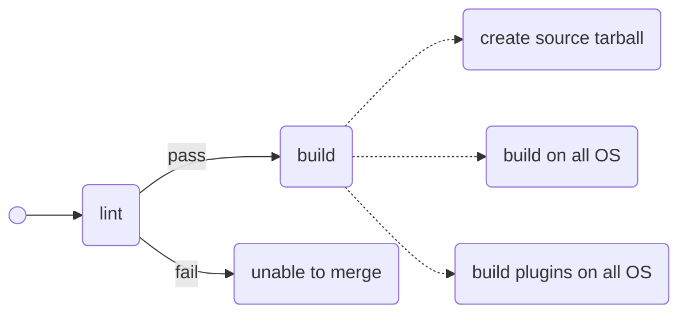
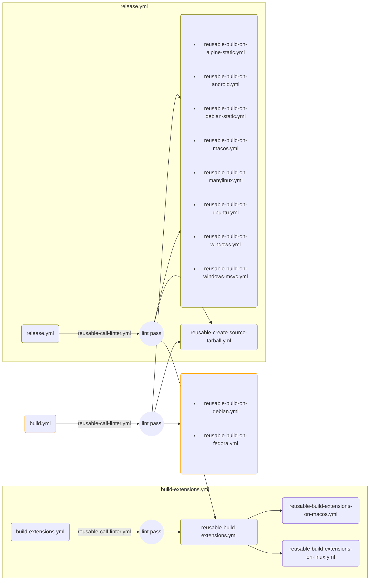

# CI Workflows

This document details the Continuous Integration (CI) workflows for WasmEdge.

## Table of Contents

- [Workflow Classification](#workflow-classification)
  - [Core and Extensions Workflows](#core-and-extensions-workflows)
  - [Linting and Compliance](#linting-and-compliance)
  - [Security and Analysis](#security-and-analysis)
  - [Installers and Specialized](#installers-and-specialized)
  - [Release and Maintenance](#release-and-maintenance)
- [External Checks](#external-checks)
- [Contributor Guidance](#contributor-guidance)
- [Build and Release](#build-and-release)
- [Workflow for build.yml](#workflow-for-buildyml)
- [Calling Structure for Reusable Workflows](#calling-structure-for-reusable-workflows)

## Workflow Classification

The WasmEdge CI is composed of various workflows. The following table details their triggers and whether they are required to pass before merging a Pull Request. Classifications marked "Unknown" require confirmation from a WasmEdge maintainer.

*(Note: The `reusable-*.yml` files in this directory are internal workflow components called by the main pipelines and are excluded from these tables. Non-workflow files like `ignore_words` and `matrix-extensions.json` are also excluded.)*

### Core and Extensions Workflows

| Workflow | Triggers | Description | Requirement | Typical Failure Causes |
|----------|----------|-------------|-------------|------------------------|
| **Core** (`build.yml`) | PRs, Push | Tests core build and unit tests across major OS. | **Must-pass** (except Fedora Rawhide) | Compilation errors, unit test failures. |
| **Extensions** (`build-extensions.yml`) | PRs, Push | Builds and tests WasmEdge plugins. | **Unknown** - Maintainer confirmation required | Missing dependencies, API mismatches. |

### Linting and Compliance

| Workflow | Triggers | Description | Requirement | Typical Failure Causes |
|----------|----------|-------------|-------------|------------------------|
| **Commit Lint** (`commitlint.yml`) | PR Target | Enforces Conventional Commits standard. | **Must-pass** | Commit message does not start with `feat:`, `fix:`, etc. |
| **Misc linters** (`misc-linters.yml`) | PRs, Push | Runs `clang-format` and style checks. | **Unknown** - Maintainer confirmation required | Code formatting deviates from WasmEdge style. |
| **IWYU checker** (`IWYU_scan.yml`) | PRs, Push | Include-What-You-Use scan. | **Unknown** - Maintainer confirmation required | Missing or unnecessary `#include` directives. |

### Security and Analysis

| Workflow | Triggers | Description | Requirement | Typical Failure Causes |
|----------|----------|-------------|-------------|------------------------|
| **CodeQL** (`codeql-analysis.yml`) | PRs, Push, Schedule | Security vulnerability analysis. | **Must-pass** | Memory leaks, unsafe patterns. |
| **Static Code Analysis** (`static-code-analysis.yml`) | PRs, Push, Dispatch | Meta's Infer static analyzer. | **Unknown** - Maintainer confirmation required | Null pointer dereferences, uninitialized variables. |

### Installers and Specialized

| Workflow | Triggers | Description | Requirement | Typical Failure Causes |
|----------|----------|-------------|-------------|------------------------|
| **Installers** (`test-installers.yml`) | PRs, Push | Tests install scripts. | **Unknown** - Maintainer confirmation required | Syntax errors in bash/python scripts. |
| **Test Wasi Testsuite** (`wasi-testsuite.yml`) | PRs, Push | Runs official WASI testsuite. | **Unknown** - Maintainer confirmation required | Incorrect WASI host function implementation. |
| **Arch-specific Builds** (`build_for_riscv.yml`, `build_for_s390x.yml`, `build_for_openwrt.yml`, `build_for_nix.yml`) | PRs, Push | Builds for alternative archs. | **Unknown** - Maintainer confirmation required | Upstream changes broke niche architecture builds. |
| **Docker Build** (`docker.yml`) | PRs, Push, Schedule | Builds and tests docker containers. | **Unknown** - Maintainer confirmation required | Dockerfile errors, path mismatches. |

### Release and Maintenance

| Workflow | Triggers | Description | Requirement | Typical Failure Causes |
|----------|----------|-------------|-------------|------------------------|
| **Labeler** (`labeler.yml`) | PR Target | Auto-labels PRs based on modified files. | **Unknown** - Maintainer confirmation required | Invalid YAML syntax in labeler config. |
| **Release** (`release.yml`) | Tag push, Dispatch | Creates GitHub releases and tarballs. | **N/A** (Not a PR check) | Upload asset failures. |
| **Winget Submit** (`winget-submit.yml`) | Release, Dispatch | Submits MSI to Windows Package Manager. | **N/A** (Not a PR check) | Winget validation failures. |

## External Checks

Some PR checks are not local `.yml` workflows, but are enforced via GitHub Apps or internal workflow steps:

| Check | Description | Requirement | Typical Failure Causes |
|-------|-------------|-------------|------------------------|
| **DCO (Developer Certificate of Origin)** | Enforced by the DCO GitHub App. Ensures all commits are signed off. | **Must-pass** | Missing `Signed-off-by` in commit messages. |
| **CodeCov** | Uploaded via steps in `build.yml` to track code coverage. | **Nice-to-pass** | Coverage dropped below acceptable thresholds. |

## Contributor Guidance

When a CI workflow fails on your Pull Request, follow these steps:

1. **Identify the Failing Workflow**: Review the PR checks section at the bottom of your PR.
2. **Review the Logs**: Click "Details", expand the failing step, and look for compiler errors or test failures.
3. **Reproduce Locally**: 
   - **Build/Test Failures**: Attempt to build WasmEdge locally with the same compiler.
   - **Formatting Issues**: Run `clang-format` on your changed files.
   - **Commit Lint**: Use `git commit --amend` to update your message to [Conventional Commits](https://www.conventionalcommits.org/en/v1.0.0/), then `git push --force`.
4. **Ask for Help**: If you cannot determine the cause or suspect a flaky test, comment on your PR asking maintainers for guidance.
## Build and Release

### WasmEdge (core)

| OS | Arch | toolchain | `docker_tag` | test | release |
| -- | ---- | --------- | ------------ | ---- | ------- |
| MacOS 13 (darwin 22) | x86_64 | clang || o | o |
| MacOS 14 (darwin 23) | arm64 | clang || o | o |
| manylinux_2_28 | x86_64 | gcc | `manylinux_2_28_x86_64` | o | o |
| manylinux_2_28 | aarch64 | gcc | `manylinux_2_28_aarch64` | o | o |
| Ubuntu 24.04 | x86_64 | clang | `ubuntu-24.04-build-clang` | o ||
| Ubuntu 24.04 | x86_64 | gcc | `ubuntu-24.04-build-gcc` | o ||
| Ubuntu 22.04 | x86_64 | gcc | `ubuntu-22.04-build-gcc` | coverage ||
| Ubuntu 20.04 | x86_64 | clang | `ubuntu-20.04-build-clang` | o | o |
| Ubuntu 20.04 | aarch64 | clang | `ubuntu-20.04-build-clang-aarch64` | o | o |

### WasmEdge plugins

| OS | Arch | toolchain | `docker_tag` | test | release |
| -- | ---- | --------- | ------------ | ---- | ------- |
| MacOS 13 (darwin 22) | x86_64 | clang || o | o |
| MacOS 14 (darwin 23) | arm64 | clang || o | o |
| manylinux_2_28 | x86_64 | gcc | `manylinux_2_28_x86_64-plugins-deps` | o | o |
| manylinux_2_28 | aarch64 | gcc | `manylinux_2_28_aarch64-plugins-deps` | o | o |
| Ubuntu 24.04 | x86_64 | clang | `ubuntu-24.04-build-clang-plugins-deps` | o ||
| Ubuntu 24.04 | x86_64 | gcc | `ubuntu-24.04-build-gcc-plugins-deps` | o ||
| Ubuntu 20.04 | x86_64 | clang | `ubuntu-20.04-build-clang-plugins-deps` | o | o |
| Ubuntu 20.04 | x86_64 | gcc | `ubuntu-20.04-build-gcc-cuda11` | - | - |
| Ubuntu 20.04 | x86_64 | gcc | `ubuntu-20.04-build-gcc-cuda12` | - | - |

Plugins that is built with CUDA enabled:
- `wasmedge_stablediffusion`

## Workflow for `build.yml`

```mermaid
flowchart LR
    %% _ is the starting point of everything
    _(( ))-->lint(lint)
    lint-->|pass|build(build)
    lint-->|fail|reject(unable to merge)
    build-.->source(create source tarball)
    build-.->oss("build on all OS")
    build-.->ext("build plugins on all OS")
```

## Calling Structure for Reusable Workflows

```mermaid
flowchart LR
    subgraph "build-extensions.yml"
        b_("build-extensions.yml")-->|reusable-call-linter.yml|l0(("lint pass"))
        l0-->b_ext("reusable-build-extensions.yml")
        b_ext-->b_ext_m("reusable-build-extensions-on-macos.yml")
        b_ext-->b_ext_l("reusable-build-extensions-on-linux.yml")
    end
    b("build.yml")-->|reusable-call-linter.yml|l1(("lint pass"))
    l1-->oss("<ul>
      <li>reusable-build-on-alpine-static.yml</li>
      <li>reusable-build-on-android.yml</li>
      <li>reusable-build-on-debian-static.yml</li>
      <li>reusable-build-on-macos.yml</li>
      <li>reusable-build-on-manylinux.yml</li>
      <li>reusable-build-on-ubuntu.yml</li>
      <li>reusable-build-on-windows.yml</li>
      <li>reusable-build-on-windows-msvc.yml</li>
    </ul>")
    subgraph "release.yml"
        rel("release.yml")-->|reusable-call-linter.yml|l2(("lint pass"))
        l2-->oss
        l2-->b_ext
        l2-->src
    end
    l1-->oss_extra("<ul>
      <li>reusable-build-on-debian.yml</li>
      <li>reusable-build-on-fedora.yml</li>
    </ul>")
    l1-->src("reusable-create-source-tarball.yml")
    classDef nostroke stroke:none;
    class l0,l1,l2 nostroke
    classDef relcls stroke:olive;
    class rel,oss,src,b_ext relcls
    classDef bcls stroke:orange;
    class b,oss_extra bcls
```
