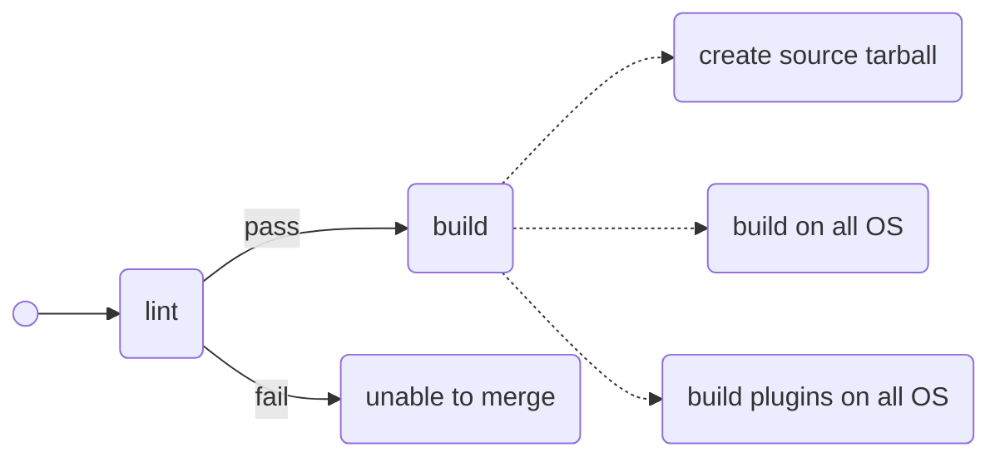
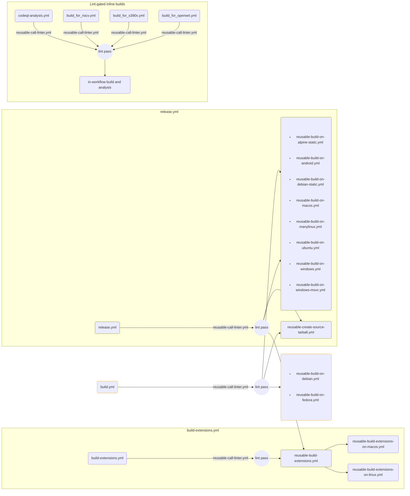

# CI Workflows

This document helps contributors understand the CI workflows.
For any pull request, it answers two questions:

- **Which checks will run on my change?** See
  [Which checks run for your change](#which-checks-run-for-your-change).
- **What do I do when a check fails?** See
  [Interpreting failures](#interpreting-failures).

> This page is derived from the workflow definitions under `.github/workflows/`.
> If you change a workflow's triggers or behavior, please update this page in the
> same pull request.

## Table of contents

- [How CI is triggered](#how-ci-is-triggered)
- [Which checks run for your change](#which-checks-run-for-your-change)
- [Workflow reference](#workflow-reference)
- [Interpreting failures](#interpreting-failures)
- [External checks](#external-checks)
- [Build and Release](#build-and-release)
- [Workflow for `build.yml`](#workflow-for-buildyml)
- [Calling Structure for Reusable Workflows](#calling-structure-for-reusable-workflows)

## How CI is triggered

Most workflows are **path-filtered**: they run only when a pull request changes
files matching their configured paths, and only against certain base branches
(commonly `master`, `proposal/**`, and release branches such as `1.2.x`). A few
checks have no path filter and therefore run on **every** pull request.

This has three practical consequences:

- **A check you do not see was not triggered.** If a workflow is absent from your
  PR's checks, your change did not match its path filter — there is nothing to fix.
- **When a check is triggered, it is expected to pass.** WasmEdge does not treat
  triggered checks as optional; see [Interpreting failures](#interpreting-failures)
  for the few documented exceptions.
- **Builds run behind a lint gate.** `Core`, `Extensions`, `CodeQL`, and the
  `riscv64`, `s390x`, and `OpenWrt` builds first run a shared clang-format check
  (`reusable-call-linter.yml`); their build and analysis jobs start only after it
  passes.

Two workflows further narrow their work *within* a run:

- **`Extensions`** has path-filtered plugin builds plus always-run WASI-NN jobs.
  Its `build_plugins` job builds only the plugin(s) whose paths changed, selected
  by `dorny/paths-filter` against
  [`.github/extensions.paths-filter.yml`](../extensions.paths-filter.yml). For
  example, editing only `plugins/wasi_nn/**` builds the `wasi_nn` plugin but not
  `wasmedge_ffmpeg`. Changes to shared plugin files (the `all` filter:
  `.github/**`, the root `CMakeLists.txt`, `plugins/CMakeLists.txt`, or
  `test/plugins/CMakeLists.txt`) and release builds build **all** plugins. Once
  the workflow is triggered, the `test_wasi_nn_ggml_rpc` and
  `build_windows_wasi_nn` jobs also run regardless of which plugin paths changed.
- **`docker`** builds only the image set affected by the change on pull requests,
  and all images on `push` or `schedule`.

## Which checks run for your change

Find the area you changed; the workflows listed there are the ones that run. Path
filters overlap, so one change can appear in more than one area — the
[Workflow reference](#workflow-reference) table is authoritative for exact triggers.

### Any change (runs on every pull request)

| Workflow | What it does | If it fails |
| -------- | ------------ | ----------- |
| **Commit Lint** (`commitlint.yml`) | Validates every commit message **and** the PR title against [Conventional Commits](https://www.conventionalcommits.org/en/v1.0.0/). | Reword the offending commits to a valid `<type>: <description>` and force-push; if the **PR title** is the problem, edit the title in the GitHub UI (no push needed). |
| **Misc linters** (`misc-linters.yml`) | Runs `codespell` (spell check) and `lineguard` (line-format check, `.lineguardrc`). | Fix the reported typos; run `lineguard` locally before pushing. |
| **Pull Request Labeler** (`labeler.yml`) | Auto-labels the PR based on the changed paths. | No action needed — this is automation. |
| **DCO** (external GitHub App) | Verifies every commit has a `Signed-off-by` line. | Sign off your commits with `git commit -s`, then force-push. |

### Core engine

Triggered by changes under `include/`, `lib/`, `tools/`, `test/` (but **not**
`test/plugins/`), `cmake/`, `thirdparty/`, or to `CMakeLists.txt`. Workflows in this
group watch slightly different subsets — for example, `IWYU checker` does not watch
`cmake/`, `CodeQL` matches C/C++ source globs rather than whole directories, and
`Nix` does not watch `test/` — so consult the
[Workflow reference](#workflow-reference) for each one's exact paths.

Shared build paths in this group can also trigger **Extensions**: `thirdparty/`,
`tools/`, `cmake/`, and `CMakeLists.txt` are in `build-extensions.yml`'s path
filter.

| Workflow | What it does | If it fails |
| -------- | ------------ | ----------- |
| **Core** (`build.yml`) | The main build: clang-format gate, then build and unit tests across macOS, manylinux, Ubuntu (gcc/clang x Debug/Release), Windows (+MSVC), Android, Fedora, Debian, and Alpine (static). Its Ubuntu coverage job also produces the **CodeCov** report. | Fix the build or unit-test failure on the reported platform. |
| **Extensions** (`build-extensions.yml`) | Also triggered by shared build paths such as `thirdparty/`, `tools/`, `cmake/`, and `CMakeLists.txt`; plugin matrix scope still follows the Extensions path filter. | Investigate like any triggered check; for failures clearly unrelated to your shared change, follow [Interpreting failures](#interpreting-failures). |
| **CodeQL** (`codeql-analysis.yml`) | Security analysis of C/C++ sources (excludes `docs/`, `.github/`, `utils/`); also runs weekly. | Address the flagged security finding. |
| **IWYU checker** (`IWYU_scan.yml`) | Include-what-you-use scan on Fedora and macOS; reports header suggestions as logs/artifacts. | Review the log and tidy includes where applicable. |
| **Static Code Analysis** (`static-code-analysis.yml`) | Meta **Infer** analysis; uploads a report artifact. | Review the report for genuine defects (e.g. null dereferences). |
| **riscv64 / s390x** (`build_for_riscv.yml`, `build_for_s390x.yml`) | Emulated build and test on these architectures. | Fix the architecture-specific failure. |
| **Nix** (`build_for_nix.yml`) | `nix build` and `nix flake check` (also triggered by `flake.nix` / `flake.lock`). | Fix the Nix build or flake check. |
| **OpenWrt** (`build_for_openwrt.yml`) | Build and test on OpenWrt (also triggered by `plugins/**` and `utils/openwrt/**`). | Fix the OpenWrt build failure. |

### Plugins

Triggered by changes under `plugins/` or `test/plugins/`.

| Workflow | What it does | If it fails |
| -------- | ------------ | ----------- |
| **Extensions** (`build-extensions.yml`) | Runs a path-filtered plugin build matrix for changed plugins, plus unconditional WASI-NN GGML RPC and Windows WASI-NN jobs. | Fix failures in changed plugin builds and in WASI-NN jobs when related to your change; for clearly unrelated WASI-NN, flaky, or upstream failures, see [Interpreting failures](#interpreting-failures). |
| **IWYU checker**, **Static Code Analysis**, **CodeQL**, **OpenWrt** | Also triggered by plugin sources (see the Core engine table above). | As above. |

Plugin-only changes do **not** trigger `Core`, `riscv64`, `s390x`, or `Nix`.

### WASI host implementation

Triggered by changes under `lib/host/wasi/`, `include/host/wasi/`, or
`thirdparty/wasi/`.

| Workflow | What it does | If it fails |
| -------- | ------------ | ----------- |
| **Test Wasi Testsuite** (`wasi-testsuite.yml`) | Builds on Ubuntu, macOS, and Windows, then runs the official [WebAssembly wasi-testsuite](https://github.com/WebAssembly/wasi-testsuite) (assemblyscript / c / rust). | Fix the WASI host-function regression. |

These paths are part of the core engine, so the **Core engine** checks above run
as well.

### Installer scripts

Triggered by changes to `utils/install.sh`, `utils/install_v2.sh`,
`utils/install.py`, or `utils/uninstall.sh`.

| Workflow | What it does | If it fails |
| -------- | ------------ | ----------- |
| **Installers** (`test-installers.yml`) | Runs a `black` format check on `install.py`, plus functional tests of the install and uninstall scripts across several Linux distributions and operating systems. | Fix the script; run `black` on `utils/install.py`. |

### Docker assets

Triggered by changes under `utils/docker/`, `utils/ffmpeg/`, `utils/opencvmini/`,
`utils/wasi-crypto/`, or `utils/wasi-nn/`.

Changes to `utils/docker/*static*` also trigger **Core** because those static
image files are included in `build.yml`'s path filter.

| Workflow | What it does | If it fails |
| -------- | ------------ | ----------- |
| **docker** (`docker.yml`) | Builds the base / CI container images affected by the change (all images on `push` or `schedule`); the scheduled run fires on days 1, 8, 15, 22, and 29 of each month (roughly weekly). | Fix the Dockerfile or bake configuration. |
| **Core** (`build.yml`) | Also runs for `utils/docker/*static*` changes because those files affect static build images. | Fix any core build or test failure caused by the static image change. |

### Release automation

These are not triggered by normal pull requests.

| Workflow | Trigger | Purpose |
| -------- | ------- | ------- |
| **release** (`release.yml`) | Tag push `X.Y.Z*` or manual dispatch | Creates the GitHub release, source tarball, and release builds. |
| **Submit WasmEdge MSI package to the Windows Package Manager Community Repository** (`winget-submit.yml`) | A published release or manual dispatch | Submits the MSI to the Windows Package Manager. |

## Workflow reference

This table is the authoritative summary of each contributor-facing workflow. The
displayed name matches what appears in a PR's checks list. Internal `reusable-*.yml`
workflows are called by the entries below and are not listed here; see
[Calling Structure for Reusable Workflows](#calling-structure-for-reusable-workflows).

| Name | File | Triggers (events, branches, paths) | Notes |
| ---- | ---- | ---------------------------------- | ----- |
| Core | `build.yml` | `push` (`master`, `X.Y.x`), `pull_request` (`master`, `proposal/**`, `X.Y.x`); paths: core build workflows, `include/`, `lib/`, `test/` (not `test/plugins/`), `utils/docker/*static*`, `thirdparty/`, `tools/`, `cmake/`, `CMakeLists.txt` | clang-format gate, then cross-platform build/test; coverage job uploads CodeCov |
| Extensions | `build-extensions.yml` | same events/branches as Core; paths: extension build workflows + config, `plugins/`, `test/plugins/`, `thirdparty/`, `tools/`, `cmake/`, `CMakeLists.txt` | clang-format gate; always runs WASI-NN GGML RPC + Windows WASI-NN jobs; path-filters the plugin build matrix |
| Commit Lint | `commitlint.yml` | `pull_request` (opened/synchronize/reopened/edited); no path filter | validates commit messages + PR title |
| Misc linters | `misc-linters.yml` | `push`, `pull_request`; no path filter | codespell + lineguard |
| CodeQL | `codeql-analysis.yml` | `push` (`master`), `pull_request` (`master`, `proposal/**`), weekly `schedule`; paths: C/C++ source globs, excluding `docs/`, `.github/`, `utils/` | clang-format gate, then CodeQL analysis |
| IWYU checker | `IWYU_scan.yml` | `push` (`master`), `pull_request` (`master`, `proposal/**`); paths: `include/`, `lib/`, `plugins/`, `test/`, `thirdparty/`, `tools/`, `CMakeLists.txt` | IWYU build scan on Fedora + macOS |
| Static Code Analysis | `static-code-analysis.yml` | `workflow_dispatch`, `push` (`master`), `pull_request` (`master`, `proposal/**`); paths: `include/`, `lib/`, `plugins/`, `test/`, `thirdparty/`, `tools/`, `cmake/`, `CMakeLists.txt` | Meta Infer; uploads report artifact |
| Test Wasi Testsuite | `wasi-testsuite.yml` | `push` (`master`), `pull_request` (`master`); paths: adapter script + workflow, `lib/host/wasi/`, `include/host/wasi/`, `thirdparty/wasi/` | runs the WebAssembly wasi-testsuite |
| Installers | `test-installers.yml` | `push` (`master`), `pull_request` (`master`); paths: workflow, `utils/install.sh`, `utils/install_v2.sh`, `utils/install.py`, `utils/uninstall.sh` | black check + installer/uninstaller tests |
| docker | `docker.yml` | `push` (`master`), `pull_request`, periodic `schedule` (days 1/8/15/22/29 of each month); paths: workflow, `utils/docker/`, `utils/ffmpeg/`, `utils/opencvmini/`, `utils/wasi-crypto/`, `utils/wasi-nn/` | builds the affected base/CI images |
| Build and Test WasmEdge on riscv64 arch | `build_for_riscv.yml` | `push` (`master`), `pull_request` (`master`, `proposal/**`); paths: core engine paths (not `test/plugins/`) | emulated build/test |
| Build and Test WasmEdge on s390x arch | `build_for_s390x.yml` | `push` (`master`), `pull_request` (`master`, `proposal/**`); paths: core engine paths (not `test/plugins/`) | emulated build/test |
| Test WasmEdge on OpenWrt | `build_for_openwrt.yml` | `push` (`master`), `pull_request` (`master`, `proposal/**`); paths: core engine paths + `plugins/`, `utils/openwrt/` | build/test on OpenWrt |
| Build WasmEdge on Nix | `build_for_nix.yml` | `push` (`master`), `pull_request` (`master`, `proposal/**`); paths: workflow, `flake.nix`, `flake.lock`, `include/`, `lib/`, `thirdparty/`, `tools/`, `cmake/`, `CMakeLists.txt` | `nix build` + `nix flake check` |
| Pull Request Labeler | `labeler.yml` | `pull_request_target` (opened/synchronize/reopened/closed); no path filter | auto-labels by path; runs in base-repo context |
| release | `release.yml` | `workflow_dispatch`, `push` tags `X.Y.Z*` | creates release, tarball, release builds |
| Submit WasmEdge MSI package to the Windows Package Manager Community Repository | `winget-submit.yml` | `workflow_dispatch`, `release` (released) | submits the MSI to the Windows Package Manager |

## Interpreting failures

1. **Find the failing check** in the PR's checks section and open its logs via
   "Details". Expand the failing step to see the compiler error or test failure.
2. **Reproduce locally** where possible:
   - Build / test failures: build WasmEdge locally, ideally with the same compiler.
   - Formatting: run the clang-format script or `lineguard`; run `black` for
     `utils/install.py`.
   - Commit Lint: use `git commit --amend` or an interactive rebase to fix messages,
     then `git push --force`.
3. **Recognize failures that are not caused by your change:**
   - **Unrelated plugin matrix entries.** When your change is confined to one
     plugin's own files, `Extensions`'s plugin build matrix includes only that
     plugin. A failure in a plugin you did not touch should only appear when a
     shared `all` filter path (for example `plugins/CMakeLists.txt`; see
     [How CI is triggered](#how-ci-is-triggered)) or a release build caused
     **every** plugin to build. The workflow still always runs the WASI-NN GGML
     RPC and Windows WASI-NN jobs; treat those failures as yours only when your
     change can affect them.
   - **Upstream breakage.** A job already failing on `master` because of an upstream
     issue (for example, a broken Fedora Rawhide package) cannot be fixed from a
     contributor PR until upstream is fixed.
   - **Flaky or infrastructure failures.** If a failure looks unrelated to your
     diff, re-run the job or ask a maintainer rather than force-pushing noise.
4. **Ask for help.** If you cannot determine the cause, comment on your PR and a
   maintainer will help.

## External checks

Some required checks are not `.yml` workflows in this directory:

| Check | Where it comes from | Contributor expectation |
| ----- | ------------------- | ----------------------- |
| **DCO** | The DCO GitHub App | Every commit must carry a valid `Signed-off-by` line (`git commit -s`). |
| **CodeCov** | The Ubuntu coverage job in `Core` uploads `build/codecov.xml` (`reusable-build-on-ubuntu.yml`); the Codecov GitHub App reports the result | Maintain or improve coverage; large unexplained drops may be flagged. |

## Build and Release

### WasmEdge (core)

| OS | Arch | toolchain | `docker_tag` | test | release |
| -- | ---- | --------- | ------------ | ---- | ------- |
| MacOS 15 (darwin 24) | x86_64 | clang || o | o |
| MacOS 14 (darwin 23) | arm64 | clang || o | o |
| manylinux_2_28 | x86_64 | gcc | `manylinux_2_28_x86_64` | o | o |
| manylinux_2_28 | aarch64 | gcc | `manylinux_2_28_aarch64` | o | o |
| Ubuntu 24.04 | x86_64 | clang | `ubuntu-24.04-build-clang` | o ||
| Ubuntu 24.04 | x86_64 | gcc | `ubuntu-24.04-build-gcc` | o ||
| Ubuntu 22.04 | x86_64 | gcc | `ubuntu-22.04-build-gcc` | coverage ||
| Ubuntu 20.04 | x86_64 | clang | `ubuntu-20.04-build-clang` | o | o |
| Ubuntu 20.04 | aarch64 | clang | `ubuntu-20.04-build-clang-aarch64` | o | o |

### WasmEdge plugins

| OS | Arch | toolchain | `docker_tag` | test | release |
| -- | ---- | --------- | ------------ | ---- | ------- |
| MacOS 15 (darwin 24) | x86_64 | clang || o | o |
| MacOS 14 (darwin 23) | arm64 | clang || o | o |
| manylinux_2_28 | x86_64 | gcc | `manylinux_2_28_x86_64-plugins-deps` | o | o |
| manylinux_2_28 | aarch64 | gcc | `manylinux_2_28_aarch64-plugins-deps` | o | o |
| Ubuntu 24.04 | x86_64 | clang | `ubuntu-24.04-build-clang-plugins-deps` | o ||
| Ubuntu 24.04 | x86_64 | gcc | `ubuntu-24.04-build-gcc-plugins-deps` | o ||
| Ubuntu 20.04 | x86_64 | clang | `ubuntu-20.04-build-clang-plugins-deps` | o | o |
| Ubuntu 20.04 | x86_64 | gcc | `ubuntu-20.04-build-gcc-cuda11` | - | - |
| Ubuntu 20.04 | x86_64 | gcc | `ubuntu-20.04-build-gcc-cuda12` | - | - |

Plugins that is built with CUDA enabled:
- `wasmedge_stablediffusion`

## Workflow for `build.yml`

```mermaid
flowchart LR
    %% _ is the starting point of everything
    _(( ))-->lint(lint)
    lint-->|pass|build(build)
    lint-->|fail|reject(unable to merge)
    build-.->source(create source tarball)
    build-.->oss("build on all OS")
    build-.->ext("build plugins on all OS")
```

## Calling Structure for Reusable Workflows

```mermaid
flowchart LR
    subgraph "build-extensions.yml"
        b_("build-extensions.yml")-->|reusable-call-linter.yml|l0(("lint pass"))
        l0-->b_ext("reusable-build-extensions.yml")
        b_ext-->b_ext_m("reusable-build-extensions-on-macos.yml")
        b_ext-->b_ext_l("reusable-build-extensions-on-linux.yml")
    end
    b("build.yml")-->|reusable-call-linter.yml|l1(("lint pass"))
    l1-->oss("<ul>
      <li>reusable-build-on-alpine-static.yml</li>
      <li>reusable-build-on-android.yml</li>
      <li>reusable-build-on-debian-static.yml</li>
      <li>reusable-build-on-macos.yml</li>
      <li>reusable-build-on-manylinux.yml</li>
      <li>reusable-build-on-ubuntu.yml</li>
      <li>reusable-build-on-windows.yml</li>
      <li>reusable-build-on-windows-msvc.yml</li>
    </ul>")
    subgraph "release.yml"
        rel("release.yml")-->|reusable-call-linter.yml|l2(("lint pass"))
        l2-->oss
        l2-->b_ext
        l2-->src
    end
    l1-->oss_extra("<ul>
      <li>reusable-build-on-debian.yml</li>
      <li>reusable-build-on-fedora.yml</li>
    </ul>")
    l1-->src("reusable-create-source-tarball.yml")
    subgraph "Lint-gated inline builds"
        cq("codeql-analysis.yml")-->|reusable-call-linter.yml|l3(("lint pass"))
        ri("build_for_riscv.yml")-->|reusable-call-linter.yml|l3
        sx("build_for_s390x.yml")-->|reusable-call-linter.yml|l3
        ow("build_for_openwrt.yml")-->|reusable-call-linter.yml|l3
        l3-->inline("in-workflow build and analysis")
    end
    classDef nostroke stroke:none;
    class l0,l1,l2,l3 nostroke
    classDef relcls stroke:olive;
    class rel,oss,src,b_ext relcls
    classDef bcls stroke:orange;
    class b,oss_extra bcls
```
