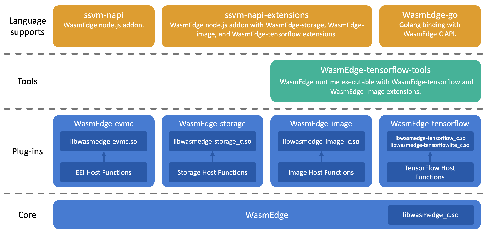

# WasmEdge Ecosystem

## Introduction

**WasmEdge** is a high performance and enterprise-ready WebAssembly (WASM) Virtual Machine for cloud, AI, and Blockchain applications. The `WasmEdge` ecosystem can be separated into the above layers.

* Core: The [WasmEdge core project](https://github.com/WasmEdge/WasmEdge).
* Plug-in: The extensions of `WASM` host functions with their dependencies.
  * [WasmEdge-TensorFlow](https://github.com/WasmEdge/WasmEdge-tensorflow) contains the host function extensions which access to [TensorFlow C library](https://www.tensorflow.org/install/lang_c).
  * [WasmEdge-Image](https://github.com/WasmEdge/WasmEdge-image) contains the host function extensions about `JPEG` and `PNG` image decodings.
  * [WasmEdge-Storage](https://github.com/WasmEdge/WasmEdge-storage) contains the host function extensions which access to [Rust storage library](https://github.com/second-state/rust_native_storage_library).
  * [WasmEdge-EVMC](https://github.com/WasmEdge/WasmEdge-evmc) contains the host function extensions that are compatible with [Ethereum Environment Interface](https://github.com/ewasm/design/blob/master/eth_interface.md).
* Tools: The executables or shared libraries.
  * [WasmEdge-TensorFlow tools](https://github.com/WasmEdge/WasmEdge-tensorflow/releases) are the released tools to execute WASM with accessing to `TensorFlow` or `TensorFlow-Lite`.
  * [WasmEdge-Storage static library](https://github.com/WasmEdge/WasmEdge-storage) is the static library which contains the host extensions that access to [Rust storage library](https://github.com/second-state/rust_native_storage_library).
  * [WasmEdge-EVMC shared libraries](https://github.com/WasmEdge/WasmEdge-evmc/releases) are the released shared libraries that are compatible with [EVMC](https://github.com/ethereum/evmc).
* Node.js Addon: The Node.js addon to access `WasmEdge`.
  * [WasmEdge-napi](https://github.com/WasmEdge/WasmEdge-napi) is the Node.js addon project for WASM functions accessing.
  * [WasmEdge-napi-extensions](https://github.com/WasmEdge/WasmEdge-napi-extensions) is the Node.js addon project for WASM runtime with `ssvm-tensorflow` and `ssvm-storage` extensions.

## Releasing Steps

1. [WasmEdge core](https://github.com/WasmEdge/WasmEdge) Releases.
2. Release a new version of plug-ins, tools, and libraries with updating to the new `WasmEdge core`.
    * [WasmEdge-Image](https://github.com/WasmEdge/WasmEdge-image)
    * [WasmEdge-TensorFlow](https://github.com/WasmEdge/WasmEdge-tensorflow)
    * [WasmEdge-Storage](https://github.com/WasmEdge/WasmEdge-storage)
    * [WasmEdge-EVMC](https://github.com/WasmEdge/WasmEdge-evmc)
3. Release [WasmEdge-napi](https://github.com/WasmEdge/WasmEdge-napi) with updating to new `WasmEdge core`.
4. Release [WasmEdge-napi-extensions](https://github.com/WasmEdge/WasmEdge-napi-extensions) with updating to new `WasmEdge core` and `WasmEdge-napi`.
