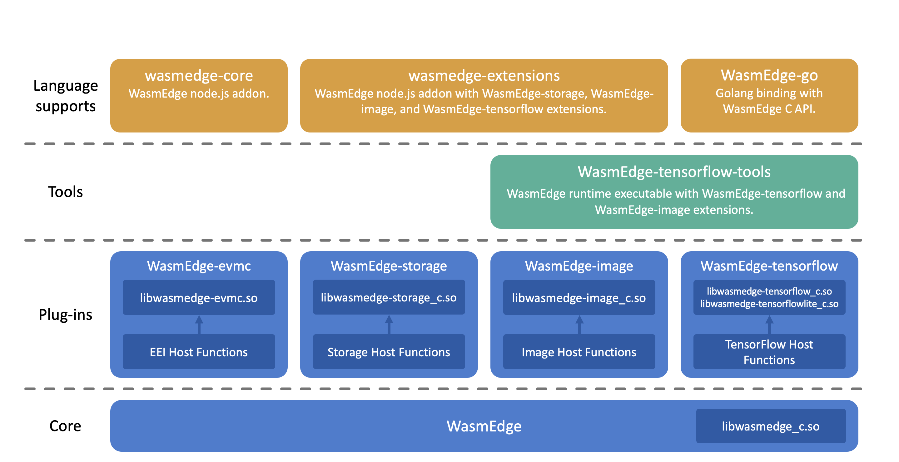

# WasmEdge Ecosystem

## Introduction

**WasmEdge** (formerly SSVM) is a high performance and enterprise-ready WebAssembly (WASM) Virtual Machine for cloud, AI, and Blockchain applications. The `WasmEdge` ecosystem can be separated into the above layers.

* Core: The [WasmEdge core project](https://github.com/WasmEdge/WasmEdge).
* Plug-ins: The extensions of `WASM` host functions with their dependencies.
  * [WasmEdge-TensorFlow](https://github.com/second-state/WasmEdge-tensorflow) contains the host function extensions which access to [TensorFlow C library](https://www.tensorflow.org/install/lang_c).
  * [WasmEdge-Image](https://github.com/second-state/WasmEdge-image) contains the host function extensions about `JPEG` and `PNG` image decodings.
  * [WasmEdge-Storage](https://github.com/second-state/WasmEdge-storage) contains the host function extensions which access to [Rust storage library](https://github.com/second-state/rust_native_storage_library).
  * [WasmEdge-EVMC](https://github.com/second-state/WasmEdge-evmc) contains the host function extensions that are compatible with [Ethereum Environment Interface](https://github.com/ewasm/design/blob/master/eth_interface.md).
* Tools: The runtime executables.
  * [WasmEdge-TensorFlow-Tools](https://github.com/second-state/WasmEdge-tensorflow-tools) are the released tools to execute WASM with accessing to `TensorFlow` or `TensorFlow-Lite`.
* Language supports: The `WasmEdge` triggering in other languages.
  * The [C API](c_api.md) is embedded in the core release as a header file and shared library.
  * [WasmEdge-core NAPI package](https://github.com/second-state/wasmedge-core) is the Node.js addon project for `WASM` functions.
  * [WasmEdge-extensions NAPI package](https://github.com/second-state/wasmedge-extensions) is the Node.js addon project for `WASM` runtime with `wasmedge-tensorflow`, `wasmedge-image`, and `wasmedge-storage` extensions.
  * [WasmEdge-go](https://github.com/second-state/WasmEdge-go) is the [Golang](https://golang.org/) binding for `WasmEdge` C API.
  * [WasmEdge-rs](https://github.com/WasmEdge/WasmEdge/tree/master/bindings/rust) is the Rust binding for `WasmEdge` C API.
