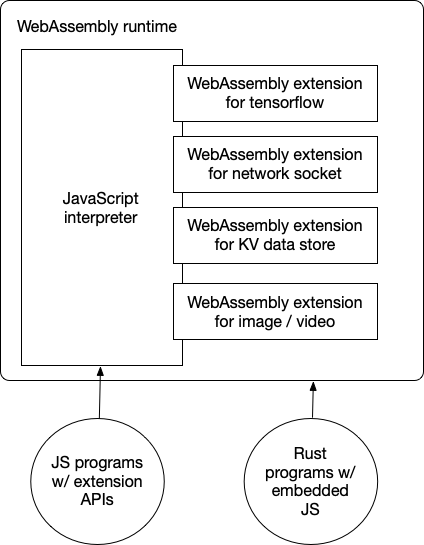

# JavaScript

WebAssembly started as a “JavaScript alternative for browsers”. The idea is to run high-performance applications compiled from languages like C/C++ or Rust safely in browsers. In the browser, WebAssembly runs side by side with JavaScript.

As WebAssembly is increasingly used in the cloud, it is now a universal runtime for cloud-native applications. Compared with Docker-like application containers, WebAssembly runtimes achieve higher performance with lower resource consumption.

In cloud-native use cases, developers often want to use JavaScript to write business applications. That means we must now support JavaScript in WebAssembly. Furthermore, we should support calling C/C++ or Rust functions from JavaScript in a WebAssembly runtime to take advantage of WebAssembly’s computational efficiency. The WasmEdge WebAssembly runtime allows you to do exactly that.

In this section, we will demonstrate how to run and enhance JavaScript in WasmEdge.

* [Getting started](js/quickstart.md) demonstrates how to run simple JavaScript programs in WasmEdge.
* [ES6 module](js/es6.md) shows how to run ES6 modules in WasmEdge.
* [CommonJS module](js/cjs.md) shows how to run CommonJS and NPM modules in WasmEdge.
* [TensorFlow](js/tensorflow.md) shows how to use WasmEdge's TensorFlow extension from its JavaScript API.
* [Networking sockets](js/networking.md) shows how to create HTTP client and server applications using the WasmEdge networking extension and its JavaScript API.
* [Async networking](js/async.md) shows how to improve HTTP server application performance by supporting asynchronous and non-blocking I/O.
* [Use Rust to implement JS API](dev/js/rust.md) discusses how to use Rust to implement and support a JavaScript API in WasmEdge.
