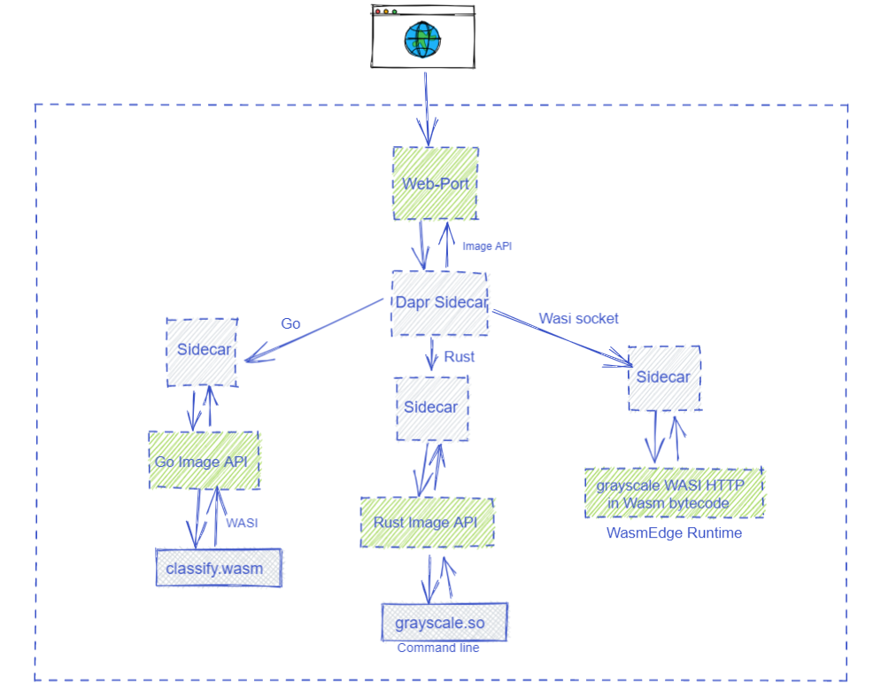
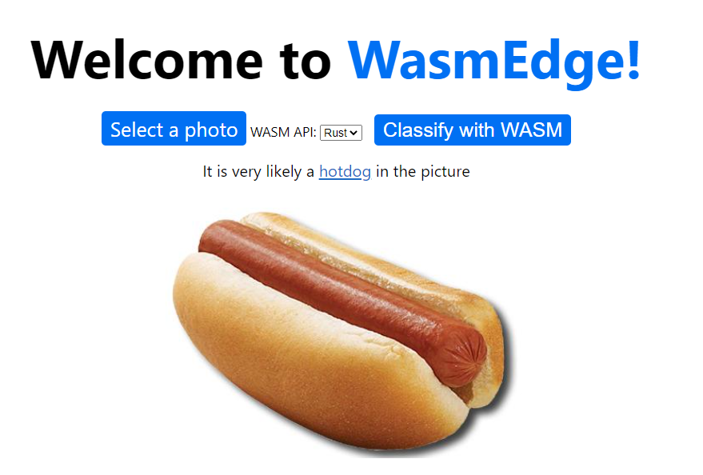

# Dapr

In this article, I will demonstrate how to use WasmEdge as a sidecar application runtime for Dapr. We use a simple NaCl written in Rust or Go to listen for API requests to the microservice. It passes the request data to a WebAssembly runtime for processing. The business logic of the microservice is a WebAssembly function created and deployed by an application developer. You can also watch [a walk-through video](https://www.youtube.com/watch?v=t_sQP6Qpf7U).

> For more insights on WasmEdge on Dapr, please refer to the article [A Lightweight, Safe, Portable, and High-performance Runtime for Dapr](https://www.secondstate.io/articles/dapr-wasmedge-webassembly/)

## Quick start

First you need to install [Go](https://golang.org/doc/install), [Rust](https://www.rust-lang.org/tools/install), [Dapr](https://docs.dapr.io/getting-started/install-dapr-cli), [WasmEdge](../../start/install.md), and the [rustwasmc](../../dev/rust/bindgen.md) compiler tool.

Next, fork or clone the demo application from Github. You can use this repo as your own application template.

```bash
git clone https://github.com/second-state/dapr-wasm
````

The demo has 3 Dapr sidecar applications.

- The [web-port](https://github.com/second-state/dapr-wasm/tree/main/web-port) project provides a public web service for a static HTML page. This is the application’s UI.
- The [image-api-rs](https://github.com/second-state/dapr-wasm/tree/main/image-api-rs) project provides a WasmEdge microservice to turn an input image into a grayscale image using the [grayscale](https://github.com/second-state/dapr-wasm/tree/main/functions/grayscale&sa=D&source=editors&ust=1634144162467000&usg=AOvVaw1uNZEDmOfXXXzLHHZWVFyD) function.
  It demonstrates the use of Rust SDKs for Dapr and WasmEdge.
- The [image-api-go](https://github.com/second-state/dapr-wasm/tree/main/image-api-go&sa=D&source=editors&ust=1634144162467000&usg=AOvVaw3pG0m0DQap9XTUAfBMyi1s) project provides a WasmEdge microservice to recognize and classify the object on an input image using the [classify](https://github.com/second-state/dapr-wasm/tree/main/functions/classify&sa=D&source=editors&ust=1634144162468000&usg=AOvVaw0zYdNzIz6MiDkZCAvm_D9q) function.
  It demonstrates the use of Go SDKs for Dapr and WasmEdge.



Dapr sidecar microservices in the demo application.

You can follow the instructions in the [README](https://github.com/second-state/dapr-wasm/blob/main/README.md) to start the sidecar services. Here are commands to build the WebAssembly functions and start the 3 sidecar services.

```bash
# Build the classify and grayscale WebAssembly functions, and deploy them to the sidecar projects
cd functions/grayscale
./build.sh
cd ../../
cd functions/classify
./build.sh
cd ../../

# Build and start the web service for the application UI
cd web-port
go build
./run_web.sh
cd ../

# Build and start the microservice for image processing (grayscale)
cd image-api-rs
cargo build
./run_api_rs.sh
cd ../

# Build and start the microservice for tensorflow-based image classification
cd image-api-go
go build --tags "tensorflow image"
./run_api_go.sh
cd ../
```

Finally, you should be able to see the web UI in your browser.



The demo application in action.

## The two WebAssembly functions

We have two functions written in Rust and compiled into WebAssembly. They are deployed in the sidecar microservices to perform the actual work of image processing and classification.

While our example WebAssembly functions are written in Rust, you can compile functions written in C/C++, Swift, Kotlin, and AssemblyScript to WebAssembly. WasmEdge also provides support for functions written in
JavaScript and DSLs.

The [grayscale](https://github.com/second-state/dapr-wasm/tree/main/functions/grayscale) function is a Rust program that reads image data from `STDIN` and writes the grayscale image into `STDOUT`.

```rust
use image::{ImageFormat, ImageOutputFormat};
use std::io::{self, Read, Write};

fn main() {
  let mut buf = Vec::new();
  io::stdin().read_to_end(&mut buf).unwrap();

  let image_format_detected: ImageFormat = image::guess_format(&buf).unwrap();
  let img = image::load_from_memory(&buf).unwrap();
  let filtered = img.grayscale();
  let mut buf = vec![];
  match image_format_detected {
    ImageFormat::Gif => {
      filtered.write_to(&mut buf, ImageOutputFormat::Gif).unwrap();
    }
    _ => {
      filtered.write_to(&mut buf, ImageOutputFormat::Png).unwrap();
    }
  };
  io::stdout().write_all(&buf).unwrap();
  io::stdout().flush().unwrap();
}
```

We use [rustwasmc](https://www.secondstate.io/articles/rustwasmc/) to build it and then copy it to the
[image-api-rs](https://github.com/second-state/dapr-wasm/tree/main/image-api-rs) sidecar.

```bash
cd functions/grayscale
rustup override set 1.50.0
rustwasmc  build --enable-ext
cp ./pkg/grayscale.wasm ../../image-api-rs/lib
```

The [classify](https://github.com/second-state/dapr-wasm/tree/main/functions/classify) function
is a Rust function that takes a byte array for image data as input and returns a string for the classification. It uses the [WasmEdge
TensorFlow API](https://www.secondstate.io/articles/wasi-tensorflow/).

```rust
use wasmedge_tensorflow_interface;

pub fn infer_internal(image_data: &[u8]) -> String {
  let model_data: &[u8] = include_bytes!("models/mobilenet_v1_1.0_224/mobilenet_v1_1.0_224_quant.tflite");
  let labels = include_str!("models/mobilenet_v1_1.0_224/labels_mobilenet_quant_v1_224.txt");

  let flat_img = wasmedge_tensorflow_interface::load_jpg_image_to_rgb8(image_data, 224, 224);

  let mut session = wasmedge_tensorflow_interface::Session::new(
    &model_data,
    wasmedge_tensorflow_interface::ModelType::TensorFlowLite,
  );
  session.add_input("input", &flat_img, &[1, 224, 224, 3])
         .run();
  let res_vec: Vec<u8> = session.get_output("MobilenetV1/Predictions/Reshape_1");

  // ... Map the probabilities in res_vec to text labels in the labels file ...

  if max_value > 50 {
    format!(
      "It {} a <a href='https://www.google.com/search?q={}'>{}</a> in the picture",
      confidence.to_string(),
      class_name,
      class_name
    )
  } else {
    format!("It does not appears to be any food item in the picture.")
  }
}
```

We use [rustwasmc](https://www.secondstate.io/articles/rustwasmc/) to build it and then copy it to the [image-api-go](https://github.com/second-state/dapr-wasm/tree/main/image-api-go) sidecar.

```bash
cd functions/classify
rustup override set 1.50.0
rustwasmc  build --enable-ext
cp ./pkg/classify_bg.wasm ../../image-api-go/lib/classify_bg.wasm
```

In the next three sections, we will look into those three sidecar services.

## The image processing sidecar

The [image-api-rs](https://github.com/second-state/dapr-wasm/tree/main/image-api-rs) sidecar application is written in Rust. It should already have the WebAssembly function `lib/grayscale.wasm` installed from the previous step. Please refer to the [functions/bin/install.sh](https://github.com/second-state/dapr-wasm/blob/main/functions/bin/install.sh) script to install the WasmEdge Runtime binary `lib/wasmedge-tensorflow-lite` and its dependencies.

The sidecar microservice runs a Tokio-based event loop that listens for incoming HTTP requests at the path `/api/image`.

```rust
#[tokio::main]
pub async fn run_server(port: u16) {
  pretty_env_logger::init();

  let home = warp::get().map(warp::reply);

  let image = warp::post().and(warp::path("api"))
                          .and(warp::path("image"))
                          .and(warp::body::bytes())
                          .map(|bytes: bytes::Bytes| {
    let v: Vec<u8> = bytes.iter().map(|&x| x).collect();
    let res = image_process(&v);
    Ok(Box::new(res))
  });

  let routes = home.or(image);
  let routes = routes.with(warp::cors().allow_any_origin());

  let log = warp::log("dapr_wasm");
  let routes = routes.with(log);
  warp::serve(routes).run((Ipv4Addr::UNSPECIFIED, port)).await
}
```

Once it receives an image file in the HTTP POST request, it invokes a WebAssembly function in WasmEdge to perform the image processing task. It creates a WasmEdge instance to interact with the WebAssembly program.

```rust
pub fn image_process(buf: &Vec<u8>) -> Vec<u8> {
  let mut child = Command::new("./lib/wasmedge-tensorflow-lite")
    .arg("./lib/grayscale.wasm")
    .stdin(Stdio::piped())
    .stdout(Stdio::piped())
    .spawn()
    .expect("failed to execute child");
  {
    // limited borrow of stdin
    let stdin = child.stdin.as_mut().expect("failed to get stdin");
    stdin.write_all(buf).expect("failed to write to stdin");
  }
  let output = child.wait_with_output().expect("failed to wait on child");
  output.stdout
}
```

The following Dapr CLI command starts the microservice in the Dapr runtime environment.

```bash
cd image-api-rs
sudo dapr run --app-id image-api-rs \
    --app-protocol http \
    --app-port 9004 \
    --dapr-http-port 3502 \
    --components-path ../config \
    --log-level debug \
    ./target/debug/image-api-rs
cd ../
```

## The Tensorflow sidecar

The [image-api-go](https://github.com/second-state/dapr-wasm/tree/main/image-api-go) sidecar application is written in Go. It should already have the WebAssembly function `lib/classify\_bg.wasm` installed from the previous step. Please refer to the [functions/bin/install.sh](https://github.com/second-state/dapr-wasm/blob/main/functions/bin/install.sh) script to install the WasmEdge Runtime Go SDK.

The sidecar microservice runs an event loop that listens for incoming HTTP requests at the path `/api/image`.

```go
func main() {
  s := daprd.NewService(":9003")

  if err := s.AddServiceInvocationHandler("/api/image", imageHandlerWASI); err != nil {
    log.Fatalf("error adding invocation handler: %v", err)
  }

  if err := s.Start(); err != nil && err != http.ErrServerClosed {
    log.Fatalf("error listenning: %v", err)
  }
}
```

Once it receives an image file in the HTTP POST request, it invokes a WebAssembly function in WasmEdge to perform the Tensorflow-based image classification task. It utilizes the Go API for WasmEdge to interact with the WebAssembly program.

```go
func imageHandlerWASI(_ context.Context, in *common.InvocationEvent) (out *common.Content, err error) {
  image := in.Data

  var conf = wasmedge.NewConfigure(wasmedge.REFERENCE_TYPES)
  conf.AddConfig(wasmedge.WASI)
  var vm = wasmedge.NewVMWithConfig(conf)

  var wasi = vm.GetImportObject(wasmedge.WASI)
  wasi.InitWasi(
    os.Args[1:],     // The args
    os.Environ(),    // The envs
    []string{".:."}, // The mapping directories
    []string{},      // The preopens will be empty
  )

  // Register WasmEdge-tensorflow and WasmEdge-image
  var tfobj = wasmedge.NewTensorflowImportObject()
  var tfliteobj = wasmedge.NewTensorflowLiteImportObject()
  vm.RegisterImport(tfobj)
  vm.RegisterImport(tfliteobj)
  var imgobj = wasmedge.NewImageImportObject()
  vm.RegisterImport(imgobj)

  vm.LoadWasmFile("./lib/classify_bg.wasm")
  vm.Validate()
  vm.Instantiate()

  res, err := vm.ExecuteBindgen("infer", wasmedge.Bindgen_return_array, image)
  ans := string(res.([]byte))
  
  vm.Delete()
  conf.Delete()

  out = &common.Content{
    Data:    []byte(ans),
    ContentType: in.ContentType,
    DataTypeURL: in.DataTypeURL,
  }
  return out, nil
}
```

The following Dapr CLI command starts the microservice in the Dapr runtime environment.

```bash
cd image-api-go
sudo dapr run --app-id image-api-go \
    --app-protocol http \
    --app-port 9003 \
    --dapr-http-port 3501 \
    --log-level debug \
    --components-path ../config \
    ./image-api-go
cd ../
```

## The web UI sidecar

The web UI service [web-port](https://github.com/second-state/dapr-wasm/tree/main/web-port) is a simple web server written in Go. It serves static HTML and JavaScript files from the static folder and sends images uploaded to `/api/hello` to the [grayscale](https://github.com/second-state/dapr-wasm/tree/main/image-api-rs) or [classify](https://github.com/second-state/dapr-wasm/tree/main/image-api-go) sidecars’ `/api/image` endpoints.

```go
func main() {
  http.HandleFunc("/static/", staticHandler)
  http.HandleFunc("/api/hello", imageHandler)
  println("listen to 8080 ...")
  log.Fatal(http.ListenAndServe(":8080", nil))
}

func staticHandler(w http.ResponseWriter, r *http.Request) {
  // ... read and return the contents of HTML CSS and JS files ...
}

func imageHandler(w http.ResponseWriter, r *http.Request) {
  // ... ...
  api := r.Header.Get("api")
  if api == "go" {
    daprClientSend(body, w)
  } else {
    httpClientSend(body, w)
  }
}

// Send to the image-api-go sidecar (classify) via the Dapr API
func daprClientSend(image []byte, w http.ResponseWriter) {
  // ... ...
  resp, err := client.InvokeMethodWithContent(ctx, "image-api-go", "/api/image", "post", content)
  // ... ...
}

// Send to the image-api-rs sidecar (grayscale) via the HTTP API
func httpClientSend(image []byte, w http.ResponseWriter) {
  // ... ...
  req, err := http.NewRequest("POST", "http://localhost:3502/v1.0/invoke/image-api-rs/method/api/image", bytes.NewBuffer(image))
  // ... ...
}
```

The JavaScript in [page.js](https://github.com/second-state/dapr-wasm/blob/main/web-port/static/page.js) simply uploads images to the [web-port](https://github.com/second-state/dapr-wasm/tree/main/web-port) sidecar’s `/api/hello` endpoint and the [web-port](https://github.com/second-state/dapr-wasm/tree/main/web-port) will request the classify or grayscale microservice based on the request header api.

```javascript
function runWasm(e) {
  const reader = new FileReader();
  reader.onload = function (e) {
    setLoading(true);
    var req = new XMLHttpRequest();
    req.open("POST", '/api/hello', true);
    req.setRequestHeader('api', getApi());
    req.onload = function () {
      // ...  display results ...
    };
    const blob = new Blob([e.target.result], {
      type: 'application/octet-stream'
    });
    req.send(blob);
  };
  console.log(image.file)
  reader.readAsArrayBuffer(image.file);
}
```

The following Dapr CLI command starts the web service for the static UI files.

```bash
cd web-port
sudo dapr run --app-id go-web-port \
    --app-protocol http \
    --app-port 8080 \
    --dapr-http-port 3500 \
    --components-path ../config \
    --log-level debug \
    ./web-port
cd ../
```

That's it. You now have a three part distributed application written in two languages!
