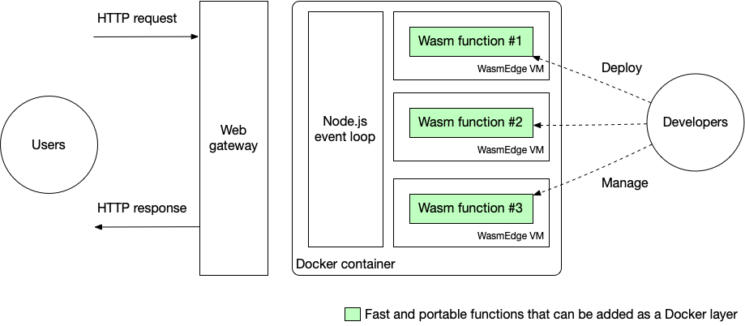

# Serverless platforms

## Why WebAssembly is sutibale for serverless functions

Almost all serverless functions provided by public cloud providers are run in container like Docker. While compared with Docker, WebAssembly has zero cold start time and small footprint.

In this section, we will show you how to run WebAssembly serverless functions in public coulds.

* [Vercel](serverless/vercel.md) discuss how to leverge WasmEdge to accelerate the Jamstack application deployed on Vercel.
* [Netlify](serverless/netlify.md) discuss how to leverge WasmEdge to accelerate the Jamstack application deployed on Netlify.
* [AWS Lambda](serverless/aws.md) discuss how to leverge WasmEdge to accelerate the serverless functions deployed on AWS Lambda.
* [Tencent](serverless/tencent.md) discuss how to leverge WasmEdge to accelerate the serverless functions deployed on Tencent cloud.

> If you would like to add more WasmEdge examples on public cloud,like Google Cloud Functions, feel free to creta a PR in this page and let the community know what you did.

Running WasmEdge from Docker containers deployed on public cloud is an easy way to add high-performance functions to web applications. Going forward an even better approach is to use [WasmEdge as the container itself](https://www.computer.org/csdl/magazine/so/5555/01/09214403/1nHNGfu2Ypi). There will be no Docker and no Node.js to bootstrap WasmEdge. This way, we can reach much higher efficiency for running serverless functions.

* [Second State Functions](serverless/secondstate.md) will discuss how to use WasmEdge ad the container itself, since Second State Functions is a serverless platform with pure WebAssembly/WasmEdge. 
