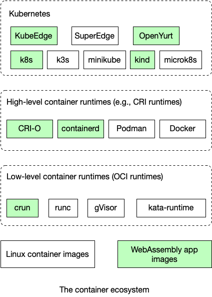

# WasmEdge in Kubernetes

Developers can leverage container tools such as Kubernetes, Docker and CRI-O to deploy, manage, and run lightweight WebAssembly applications. In this chapter, we will demonstrate how Kubernetes ecosystem tools work with [WasmEdge](https://github.com/WasmEdge/WasmEdge) WebAssembly applications.

Compared with Linux containers, [WebAssembly could be 100x faster at startup](https://www.infoq.com/articles/arm-vs-x86-cloud-performance/), have a much smaller memory and disk footprint, and have a better-defined safety sandbox. However, the trade-off is that WebAssembly requires its own language SDKs, and compiler toolchains, making it a more constrained developer environment than Docker. WebAssembly is increasingly used in Edge Computing scenarios where it is difficult to deploy Docker containers or when the application performance is vital.

One of the great advantages of Linux application containers is the rich ecosystem of tools. The good news is that you can use the exact same tools to manage WebAssembly applications, enabling Linux containers and WebAssembly apps to run side-by-side in the same system.

The contents of this chapter are organized as follows.

* [Quick start](kubernetes/quickstart.md) provides simple and scripted tutorials to run WasmEdge-based applications as container images in Kubernetes.
* [Demo apps](kubernetes/demo.md) discusses the two demo WasmEdge applications we will run in Kubernetes clusters. Those applications are compiled from Rust source code, packaged as OCI images, and uploaded to Docker Hub.
* [Container runtimes](kubernetes/container.md) covers how to configure low level container runtimes, such as crun, to load and run WebAssembly OCI images.
* [CRI runtimes](kubernetes/cri.md) covers how to configure and use high level container runtimes, such as CRI-O and containerd, to load and run WebAssembly OCI images on top of low level container runtimes.
* [Kubernetes](kubernetes/kubernetes.md) covers how to configure and use Kubernetes and Kubernetes variations, such as KubeEdge and SuperEdge, to load and run WebAssembly OCI images on top of CRI runtimes.

The goal is to load and run WebAssembly OCI images side by side with Linux OCI images (e.g., today's Docker containers) across the entire Kubernetes stack.
