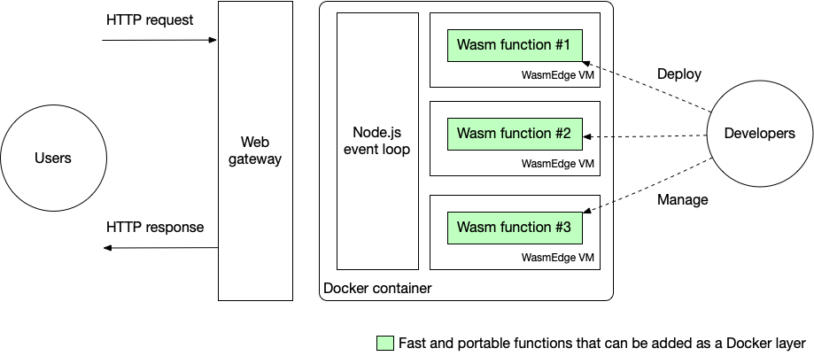

# Serverless platforms

Our vision for the future is to run WebAssembly as an alternative lightweight runtime side-by-side with Docker and microVMs in cloud native infrastructure. WebAssembly offers much higher performance and consumes much less resources than Docker-like containers or microVMs. However, the public cloud only supports running WebAssembly inside a microVM. Nonetheless, running WebAssembly functions inside a microVM still offers many advantages over running containerized NaCl programs.

Running WebAssembly functions inside Docker-like containers offer advantages over running NaCl programs directly in Docker.

For starters, WebAssembly provides fine-grained runtime isolation for individual functions. A microservice could have multiple functions and support services running inside a Docker-like container. WebAssembly can make the microservice more secure and more stable.

Second, the WebAssembly bytecode is portable. Developers only need to build it once and do not need to worry about changes or updates to the underlying Vercel serverless container (OS and hardware). It also allows developers to reuse the same WebAssembly functions in other cloud environments.

Third, WebAssembly apps are easy to deploy and manage. They have much less platform dependencies and complexities compared with NaCl dynamic libraries and executables.

Finally, the [WasmEdge Tensorflow API](https://www.secondstate.io/articles/wasi-tensorflow/) provides the most ergonomic way to execute Tensorflow models in the Rust programming language. WasmEdge installs the correct combination of Tensorflow dependency libraries, and provides a unified API for developers.

In this section, we will show you how to run WebAssembly serverless functions in public clouds. Each platform has its own code template and contains two examples in Rust, one is the normal image processing, The other one is TensorFlow inference using the WasmEdge TensorFlow SDK.

* [Vercel](serverless/vercel.md) discuss how to leverage WasmEdge to accelerate the Jamstack application deployed on Vercel.
* [Netlify](serverless/netlify.md) discuss how to leverage WasmEdge to accelerate the Jamstack application deployed on Netlify.
* [AWS Lambda](serverless/aws.md) discuss how to leverage WasmEdge to accelerate the serverless functions deployed on AWS Lambda.
* [Tencent](serverless/tencent.md) discuss how to leverage WasmEdge to accelerate the serverless functions deployed on Tencent cloud.

> If you would like to add more WasmEdge examples on public cloud platform,like Google Cloud Functions, feel free to create a PR for WasmEdge and let the community know what you did.

Running WasmEdge from Docker containers deployed on public cloud is an easy way to add high-performance functions to web applications. Going forward an even better approach is to use [WasmEdge as the container itself](https://www.computer.org/csdl/magazine/so/5555/01/09214403/1nHNGfu2Ypi). There will be no Docker and no Node.js to bootstrap WasmEdge. This way, we can reach much higher efficiency for running serverless functions.

* [Second State Functions](serverless/secondstate.md) will discuss how to use WasmEdge ad the container itself, since Second State Functions is a serverless platform with pure WebAssembly/WasmEdge.
