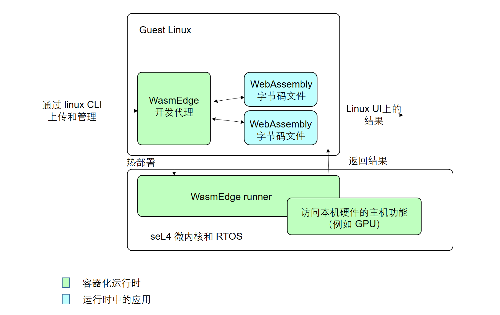

# WasmEdge on seL4

[视频演示](https://youtu.be/2Qu-Trtkspk) | [Build logs](https://github.com/second-state/wasmedge-seL4/runs/3982081148?check_suite_focus=true) | [Build artifact](https://github.com/second-state/wasmedge-seL4/actions/runs/1374510169)

在本文中，我们演示了如何在 seL4 RTOS 上运行 WasmEdge，分为两部分：

1. seL4 上的 Guest Linux OS：这是 WasmEdge runtime 的控制器，它将把 wasm 程序发送到作为 seL4 上的代理的 WasmEdge runner 来执行。
2. seL4 上的 WasmEdge runner：这是 wasm 程序运行时，它将从 Guest Linux OS 执行给定的 wasm 程序。

下图说明了系统的架构。



该演示基于 Linux 上的 seL4 模拟器。

## 快速开始

### 系统要求

硬件:

- 至少 4GB 的 内存
- 至少 20GB 的磁盘存储空间（以下安装完成后 wasmedge_sel4 目录将包含超过 11GB 的数据）

软件: 安装了开发工具包（例如：Python）的 Ubuntu 20.04。 我们推荐 [GitHub Actions Ubuntu 20.04 VM](https://github.com/actions/virtual-environments/blob/main/images/linux/Ubuntu2004-README.md) (查看 [已安装的 apt 包](https://github.com/actions/virtual-environments/blob/main/images/linux/Ubuntu2004-README.md#installed-apt-packages) 列表). 或者，你可以使用我们的 Docker 镜像 (查看 [Dockerfile](https://github.com/second-state/wasmedge-seL4/blob/main/docs/Dockerfile.sel4_build)).

```bash
$ docker pull wasmedge/sel4_build
$ docker run --rm -v $(pwd):/app -it wasmedge/sel4_build
(docker) root#
```

> 如果你不想自己搭建 seL4 系统模拟器，你可以从我们的 GitHub Actions 下载 [build artifact](https://github.com/second-state/wasmedge-seL4/actions/runs/1374510169), 并直接跳到 [启动-wasmedge-seL4](#boot-wasmedge-sel4)。

### 自动安装：一体化脚本

使用我们的一体化构建脚本：

```bash
wget -qO- https://raw.githubusercontent.com/second-state/wasmedge-seL4/main/build.sh | bash
```

这将在 seL4 上克隆并构建 wasmedge 到镜像。

完成构建脚本后，你会生成一个文件夹 `sel4_wasmedge`.

如果此自动安装成功完成，请跳过手动安装信息并继续 [启动-wasmedge-sel4](https://github.com/second-state/wasmedge-seL4#boot-wasmedge-sel4)

### 手动安装：管理内存使用

上述一体化脚本在大多数情况下都可以使用。 但是，如果你的系统资源紧张并且遇到错误，例如 `ninja: build stopped: subcommand failed`，请注意，你可以通过将 `-j` 参数显式传递给 `ninja` 命令（在 `build.sh` 文件的最后一行）来降低安装的并行度。 你会看到，Ninja 默认运行最多的并行进程，因此以下过程是一种显式设置/减少并行化的方法。

手动拉取 `wasmedge-sel4` 仓库。

```bash
cd ~
git clone https://github.com/second-state/wasmedge-seL4.git
cd wasmedge-seL4
```

手动编辑 `build.sh` 文件。

```bash
vi build.sh
```

将以下 `-j` 参数添加到文件的最后一行，即：

```bash
ninja -j 2
```

使 `build.sh` 文件可执行。

```bash
sudo chmod a+x build.sh
```

运行编辑后的 `build.sh` 文件。

```bash
./build.sh
```

完成此手动安装后，请按照以下步骤操作； 启动-wasmedge-sel4；

### 启动-wasmedge-seL4

```bash
cd sel4_wasmedge/build
./simulate
```

预计输出：

```bash
$ ./simulate: qemu-system-aarch64 -machine virt,virtualization=on,highmem=off,secure=off -cpu cortex-a53 -nographic  -m size=2048  -kernel images/capdl-loader-image-arm-qemu-arm-virt
ELF-loader started on CPU: ARM Ltd. Cortex-A53 r0p4
  paddr=[6abd8000..750cf0af]
No DTB passed in from boot loader.
Looking for DTB in CPIO archive...found at 6ad18f58.
Loaded DTB from 6ad18f58.
   paddr=[60243000..60244fff]
ELF-loading image 'kernel' to 60000000
  paddr=[60000000..60242fff]
  vaddr=[ff8060000000..ff8060242fff]
  virt_entry=ff8060000000
ELF-loading image 'capdl-loader' to 60245000
  paddr=[60245000..6a7ddfff]
  vaddr=[400000..a998fff]
  virt_entry=408f38
Enabling hypervisor MMU and paging
Jumping to kernel-image entry point...

Bootstrapping kernel
Warning: Could not infer GIC interrupt target ID, assuming 0.
Booting all finished, dropped to user space
<<seL4(CPU 0) [decodeUntypedInvocation/205 T0xff80bf85d400 "rootserver" @4006f8]: Untyped Retype: Insufficient memory (1 * 2097152 bytes needed, 0 bytes available).>>
Loading Linux: 'linux' dtb: 'linux-dtb'

...(omitted)...

Starting syslogd: OK
Starting klogd: OK
Running sysctl: OK
Initializing random number generator... [    3.512482] random: dd: uninitialized urandom read (512 bytes read)
done.
Starting network: OK
[    4.086059] connection: loading out-of-tree module taints kernel.
[    4.114686] Event Bar (dev-0) initalised
[    4.123771] 2 Dataports (dev-0) initalised
[    4.130626] Event Bar (dev-1) initalised
[    4.136096] 2 Dataports (dev-1) initalised

Welcome to Buildroot
buildroot login:
```

### 在 guest linux 上登录

输入 `root` 登录

```bash
buildroot login: root
```

预计输出：

```bash
buildroot login: root
#
```

### 执行 wasm 示例

#### 示例 A: nbody-c.wasm

运行 nbody 模拟。

```bash
wasmedge_emit /usr/bin/nbody-c.wasm 10
```

预计输出：

```bash
[1900-01-00 00:00:00.000] [info] executing wasm file
-0.169075164
-0.169073022
[1900-01-00 00:00:00.000] [info] execution success, exit code:0
```

#### 示例 B: hello.wasm

运行一个简单的应用程序来打印 `hello, sel4` 和一个简单的计算。

```bash
wasmedge_emit /usr/bin/hello.wasm
```

预计输出：

```bash
[1900-01-00 00:00:00.000] [info] executing wasm file
hello, sel4
1+2-3*4 = -9
[1900-01-00 00:00:00.000] [info] execution success, exit code:0
```
